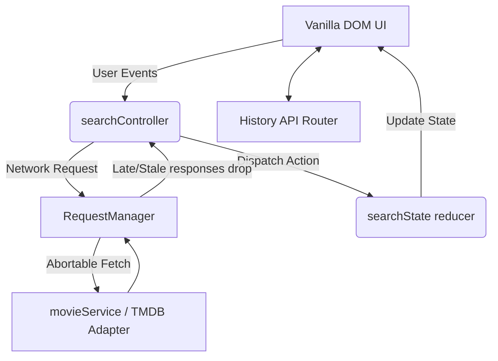

# Cinesift

Cinesift is a vanilla JavaScript single-page application (SPA) for searching, discovering, and saving movies. Built without any UI frameworks (like React or Vue), it uses a unidirectional data flow and custom state management to deliver a fast, responsive, and robust experience.

## Overview
Cinesift interfaces with the TMDB API to provide:
- Instant search with robust debounce and race-condition prevention.
- "Discover" capabilities via server-side genre filtering.
- Client-side filtering when searching by text.
- Movie details with trailers, cast, and similar movies.
- A local Watchlist with cross-tab syncing and recovery.
- Accessible, responsive UI that works on devices from 320px wide up to large desktop screens.

## Run Locally

1. **Install dependencies:**
   ```bash
   npm install
   ```
2. **Setup environment:**
   Copy `.env.example` to `.env.local` and configure your mode (see Env Vars).
3. **Start the dev server:**
   ```bash
   npm run dev
   ```
4. **Run tests:**
   ```bash
   npm run test
   ```
5. **Build for production:**
   ```bash
   npm run build
   ```

## Env Vars
The `.env.local` file configures how the app communicates with TMDB.
- `VITE_TMDB_MODE`: Can be `direct` (calls TMDB directly), `mock` (uses local mock data with simulated latencies, excellent for testing), or `proxy` (routes through a backend).
- `VITE_TMDB_TOKEN`: Your TMDB API Read Access Token (required for `direct` mode).

*Note: In `direct` mode, your `VITE_` token is publicly exposed in the browser bundle.*

## Architecture Diagram



## Proving Debounce and Race Protection

To manually verify the robustness of the asynchronous logic, use the query parameters `?debug=1` (shows the diagnostics panel) and `?mock=1` (forces mock mode with deterministic latencies).

**Steps:**
1. Open the app with `/?debug=1&mock=1`.
2. Clear the Network tab (if testing in devtools) and ensure the diagnostics panel is visible at the bottom left.
3. Type `batman` rapidly.
4. Stop typing and wait.

**Expected Numbers:**
- **Input events**: 6
- **Valid keystrokes**: 5
- **Timers created**: 5
- **Timers cancelled**: 4
- **Timers fired**: 1
- **API requests**: Exactly 1 (for "batman"). 

### Race-Condition Verification (`?noabort=1`)
To prove that our `Layer 3` guard works even without `AbortController` saving us:
1. Load `/?debug=1&mock=1&noabort=1`.
2. Type `bat` (which has a mock latency of 1800ms).
3. Immediately append `man` (which has a latency of 250ms).
4. The `man` request resolves quickly and displays.
5. 1.5 seconds later, the `bat` request resolves.
**Expected:** The UI does not flicker. The Diagnostics Panel will show `stale_discarded: 1`, proving the late response was correctly ignored by the RequestManager ID check.

## Tech Decisions
- **Vanilla JS**: ES Modules and standard DOM APIs were chosen over frameworks to keep the payload tiny and rely strictly on web standards.
- **State Management**: A Redux-like unidirectional store (`searchState.js`) decoupled from the DOM.
- **Race Protection**: Handled via three layers: `AbortController` (network layer), `requestManager` incrementing IDs (manager layer), and `searchReducer` checking query matches (reducer layer).
- **History API Router**: Implemented a custom SPA router that properly intercepts `<a data-link>` tags to prevent full page reloads, while syncing nicely with `popstate`.

## Limitations
- **Filters in text-search mode**: The TMDB API does not support mixing `/search/movie` text queries with filtering (like genres). Therefore, filters during text searches are applied *client-side* to the loaded results only (a visible note is displayed when this happens).
- **Token exposure**: Using `VITE_TMDB_TOKEN` in `direct` mode exposes the read token to the client. In a real-world scenario, a proxy backend should be used.

---
*This product uses the TMDB API but is not endorsed or certified by TMDB.*
